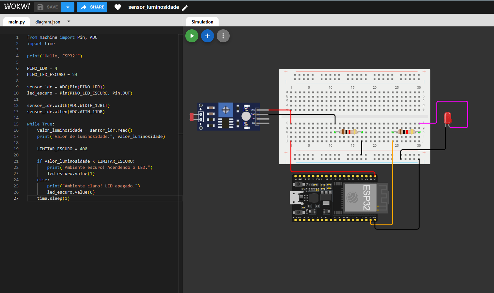
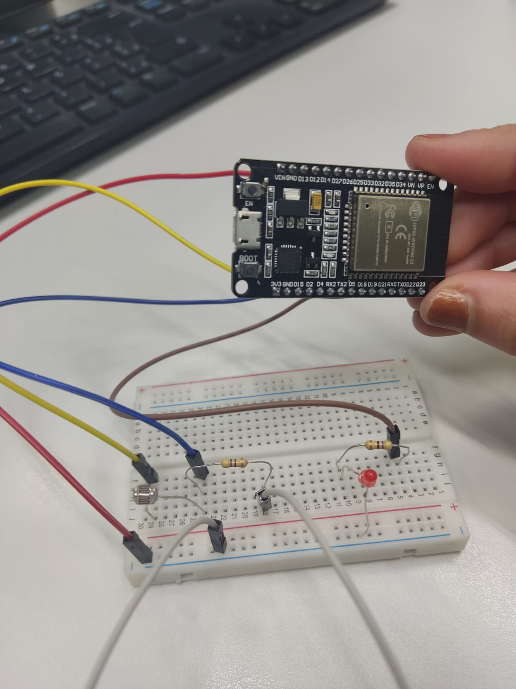

# Sensor de Luminosidade

**Descrição**
* Sensor de luminosidade, reconhece a luminosidade do local, e ao escurecer o LED acende 

---
# Sensor de Proximidade

**Descrição**
* Sensor de proximidade, foi utilizado um sensor ultrassônico para detectar quando um item se aproxima e lançar um alerta no terminal e acender o LED ao detectar um intruso

---
# Sensor de Umidade

**Descrição**
* Sensor de umidade que detecta a necessidade de irrigação em uma planta, apresenta mensagem "Solo seco, é hora de regar!" e acende o LED ao não detectar umidade.

---

# Detector de caixas

.jpeg)

**Descrição**
* Identifica e incrementa sempre que um objeto for detectado. Sempre que for identificado um total de 10 itens, conta como uma nova caixa, e o LED acende alertando, também é possível identificar a quantidade de caixas. 

---

## Sobre
O intuito deste projeto é colocar em prática o conhecimento adquirido na matéria de IOT, sobre programação em Python, utilização da plataforma Wokwi para simulação de ESP32 e programação, no curso Técnico de Desenvolvimento de Sistemas do [SENAI JANDIRA](https://sp.senai.br/unidade/jandira/).

---
## Tecnologias ultilizadas
- Wokwi
- ESP32
- MicroPython
- Git
- MarkDown

---
# Autor
- [Laura Sofia](https://www.linkedin.com/in/laura-sofia-0a5b06326/?trk=opento_sprofile_topcard)

- [Letícia Souza](https://www.linkedin.com/in/leticia-souza-almeida-84712a2b5/) 

